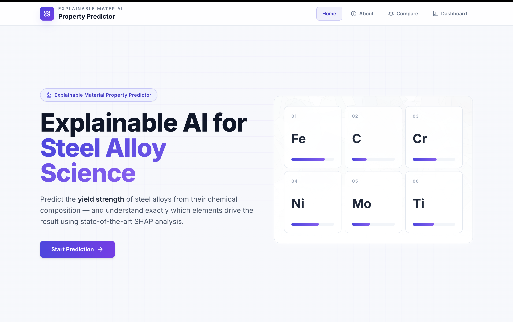
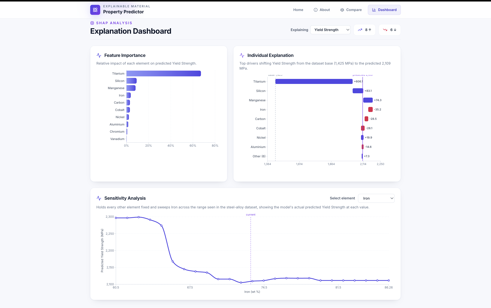
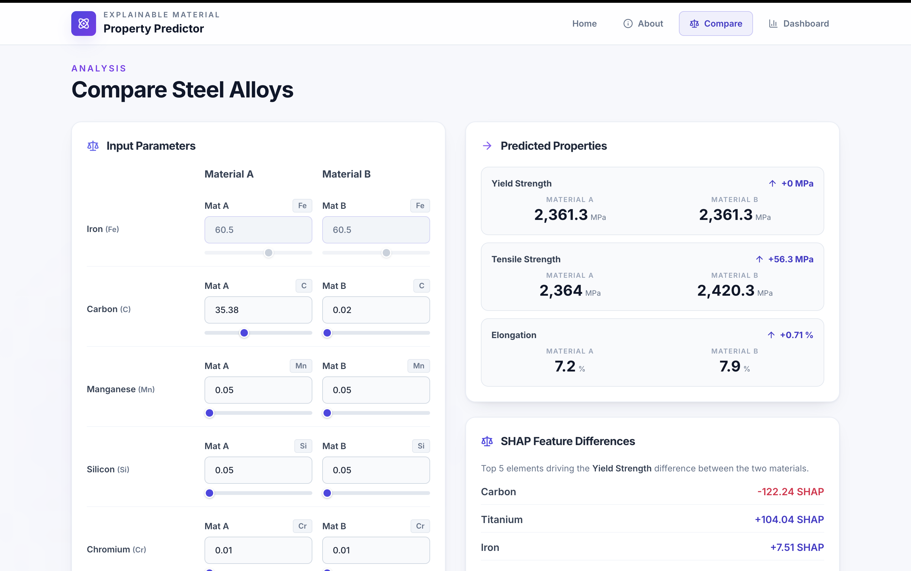

# 🔩 Explainable AI for Steel Alloy Property Prediction

<div align="center">

[](https://steel-property.web.app/)
[](https://steel-property.web.app/)
[](https://vitejs.dev/)
[](https://fastapi.tiangolo.com/)
[](https://shap.readthedocs.io/)
[](LICENSE)

**Predict mechanical properties of steel alloys from chemical composition — with full, game-theoretic explainability via SHAP.**

[**🚀 Try the Live Demo →**](https://steel-property.web.app/)

> ⚠️ **Cold Start Notice:** The backend runs on Render's free tier. First request may take **~60 seconds** to boot. Subsequent calls are instant.

</div>

---

## 📸 Dashboard Preview

**Home**



**SHAP Explanation Dashboard** — Feature importance, waterfall chart, and ICE sensitivity curve



**Material Comparison** — Side-by-side A vs. B with SHAP feature deltas



> Place these images in `assets/` at the repo root for GitHub to render them.

---

## 🎯 What This Does

Traditional steel property testing is **destructive, expensive, and slow**. ML models predict fast — but are black boxes. This tool bridges both worlds:

- **Predicts** Yield Strength, Tensile Strength (MPa), and Elongation (%) from 14 compositional elements
- **Explains** every prediction with SHAP values — which elements pushed the result up or down, and by how much
- **Compares** two alloy profiles side-by-side with delta analysis
- **Exports** one-click PDF reports suitable for academic or engineering use

---

## ✨ Key Features

### 🔮 Prediction Dashboard
- Composition input form with **auto-balancing Iron (Fe)** (always sums to 100%)
- Real-time predictions via FastAPI backend
- Responsive light-mode UI

### 📊 SHAP Explainability
| Feature | Description |
|---|---|
| **Feature Importance Bar Chart** | Global impact ranking of each alloying element |
| **Waterfall Chart** | Per-prediction breakdown: base value + element contributions = final output |
| **ICE Sensitivity Curve** | Sweeps one element across its real data range, holding all others fixed — true model behavior, no approximations |

### ⚖️ Material Comparison
- A vs. B side-by-side analysis
- Δ MPa difference calculation
- Top SHAP shift drivers identified automatically

### 📄 PDF Report Export
- Academic-grade report with input composition, predictions, and top SHAP explanations
- One click, no server dependency

---

## 🤖 Model Performance

Trained with `RandomForestRegressor` (one per property), 80/20 held-out split on `steel_strength.csv`:

| Property | R² | MAE |
|---|---|---|
| Yield Strength | ≈ 0.82 | ≈ 79 MPa |
| Tensile Strength | ≈ 0.88 | ≈ 71 MPa |
| Elongation (%) | ≈ 0.38 | ≈ 2.7 % |

> Elongation's lower R² is expected — it's governed by microstructure and processing history that composition alone cannot encode. This is a known limitation, not a modeling failure.

**Self-healing backend:** On startup, the model trains automatically if `model.pkl` is missing, and retrains if the scikit-learn version has changed (prevents `InconsistentVersionWarning` silently corrupting predictions).

---

## 🏗️ Architecture

```
steel-alloy-xai/
├── backend/
│   ├── app.py              # FastAPI routes + SHAP computation
│   ├── model.py            # RandomForest training + version check
│   ├── test_workflow.py    # Smoke test
│   └── steel_strength.csv  # Training dataset (14 elements, N alloys)
├── frontend/
│   ├── src/
│   │   ├── components/     # Dashboard, SHAP charts, Comparison, PDF
│   │   └── App.jsx
│   ├── .env                # VITE_API_BASE_URL
│   └── vite.config.js
├── requirements.txt        # Pinned Python deps
├── start.bat               # One-click Windows launcher
└── assets/                 # README screenshots
```

---

## 🛠️ Tech Stack

| Layer | Technology |
|---|---|
| Frontend | React (Vite), Tailwind CSS, Recharts, jsPDF, Lucide Icons |
| Backend | FastAPI, Uvicorn |
| ML | Scikit-Learn (RandomForestRegressor) |
| Explainability | SHAP (SHapley Additive exPlanations) |
| Deployment | Firebase Hosting (frontend) + Render (backend) |

---

## 🚀 Running Locally

### Quick Start (Windows)
```bash
start.bat
```
Launches backend on `:8080`, frontend on `:5173`, opens browser.

### Manual Setup

**Backend** (run from project root, not `backend/`):
```bash
python -m venv .venv
# Windows:
.venv\Scripts\activate
# macOS/Linux:
source .venv/bin/activate

pip install -r requirements.txt
uvicorn backend.app:app --reload --port 8080
```
- API: `http://127.0.0.1:8080`
- Interactive docs: `http://127.0.0.1:8080/docs`
- Model trains automatically on first launch

**Frontend:**
```bash
cd frontend
npm install
npm run dev
```
- App: `http://localhost:5173`
- Configure API URL in `frontend/.env` via `VITE_API_BASE_URL`

**Smoke test:**
```bash
python -m backend.test_workflow
```

---

## 🔬 Academic Context

This prototype demonstrates how **Explainable AI (XAI)** can be responsibly applied to materials engineering — a domain where "trust me, the model says so" is insufficient for adoption. SHAP provides game-theoretic guarantees (based on Shapley values from cooperative game theory) that each element's attributed contribution is **consistent, locally accurate, and additive**.

The ICE curve implementation is real: the backend holds all other elements fixed at the input values and sweeps the selected element across its observed range in the training data — returning actual model outputs, not approximations or interpolations.

This approach directly supports:
- Accelerated alloy design without destructive testing
- Hypothesis generation for metallurgists
- Audit trails for ML-assisted engineering decisions

---

## 🤝 Contributing

Contributions are welcome. Good starting points:

- [ ] Add more alloy datasets (stainless, tool steels, HSLA)
- [ ] Swap RandomForest for XGBoost / LightGBM and benchmark
- [ ] Add SHAP interaction values for element-pair effects
- [ ] Docker + docker-compose for one-command deployment
- [ ] Unit tests for SHAP computation

Open an issue to discuss, or fork and submit a PR.

---

## 📄 License

MIT — free to use, modify, and distribute with attribution.

---

<div align="center">

Built with 🔬 for materials scientists and ML engineers who believe models should explain themselves.

⭐ **Star this repo if it helped you** — it supports continued development.

</div>
